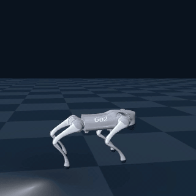

# Kine2Go research fork

A fork of [`nomagiclab/kine2go-pipeline`](https://github.com/nomagiclab/kine2go-pipeline). Recorded results: a preregistered single-reference conditional-AMP **negative** on command following, and a three-seed reference-seam RMSE intervention. Evidence map: [`docs/RESEARCH_INDEX.md`](docs/RESEARCH_INDEX.md).

[](https://arxiv.org/abs/2606.14433)
[](https://huggingface.co/datasets/MIMUW-Robotics/kine2go)

> **AMP, frozen 2026-08-13.** Span **0.009 m/s** (need ≥ 0.4); **3/5** repeats at 1.5 m/s fell.
>
> **Seam, v2 JSON record.** Same start, three seeds, repaired vs original cycle seam: RMSE **-29% / -23% / -41%** (aggregate **-31%**). Both arms stay near ~1.4 m/s.



Mid-training clip (iter 1000): the policy does not hold commanded speed. Frozen v5 numbers are in [`eval_results/amp_clean_run_5000_v5.json`](eval_results/amp_clean_run_5000_v5.json).

Development milestone `0ad4343` is provenance for the archive.

## Scope

This repository contains:

- Kine2Go motion retargeting and Genesis Go2 imitation infrastructure;
- a conditional discriminator over transition features `(s, s', c)`;
- command-support-aware curriculum and matched real/fake condition sampling;
- paired policy/discriminator checkpoint semantics;
- a frozen quantitative evaluator, a portable launcher, and canonical result artifacts;
- a preregistered clean-run protocol, correctness audit, and explicit claim boundary;
- the three-seed seam JSON record (`eval_results/*_v2.json`).

Canonical evidence is indexed in [`docs/RESEARCH_INDEX.md`](docs/RESEARCH_INDEX.md).

## Repository map

```text
motion_retargeting/   upstream motion-retargeting pipeline and source assets
motion_imitation/     Genesis imitation and conditional-AMP training
go2_genesis/          Go2 simulation environment and logging utilities
data/                 canonical conditioned discriminator data + generator
evaluation/           frozen v5 evaluator + portable launcher
eval_results/         AMP v5 result + seam v2 JSON record
tests/                CPU-safe conditional-AMP regression tests
docs/                 protocol, audit, provenance, and reproduction notes
docs/media/           README clip of the AMP command-follow failure
```

## Installation

The frozen baseline targets Python 3.12, PyTorch 2.10.0, and Genesis 0.3.10.

```bash
git clone https://github.com/kairoi-k/kine2go-research.git
cd kine2go-research
# research fork; for the upstream pipeline use nomagiclab/kine2go-pipeline
uv sync --frozen
```

Full simulation and training require a Genesis-compatible GPU environment and the relevant motion/checkpoint assets. See [`docs/REPRODUCIBILITY.md`](docs/REPRODUCIBILITY.md) for the exact reproducibility boundary.

## Training entry point

A maintained conditional-AMP launch looks like:

```bash
python -m motion_imitation.amp_imitation \
  <experiment-name> <motion.npy> \
  --num-envs 16384 \
  --max-iterations 5000 \
  --disc-data data/disc_data_c6.npy
```

Exact frozen launch and gates: [`docs/clean_run_preregistration.md`](docs/clean_run_preregistration.md). New experiments get new result identities.

## Frozen evidence

| Artifact | Role |
|---|---|
| [`RESEARCH_MANIFEST.md`](RESEARCH_MANIFEST.md) | compact state of record |
| [`docs/clean_run_preregistration.md`](docs/clean_run_preregistration.md) | protocol and final verdict |
| [`docs/IMPLEMENTATION_AUDIT.md`](docs/IMPLEMENTATION_AUDIT.md) | correctness audit |
| [`evaluation/quant_eval_v5.py`](evaluation/quant_eval_v5.py) | frozen evaluator (`v5-frozen-20260813`) |
| [`evaluation/run_quant_eval_v5.py`](evaluation/run_quant_eval_v5.py) | path-portable launcher; does not rewrite v5 |
| [`eval_results/amp_clean_run_5000_v5.json`](eval_results/amp_clean_run_5000_v5.json) | canonical v5 AMP result |
| [`eval_results/README.md`](eval_results/README.md) | AMP + seam artifact list |
| [`docs/REPRODUCIBILITY.md`](docs/REPRODUCIBILITY.md) | environment and reproduction boundary |
| [`docs/PROVENANCE.md`](docs/PROVENANCE.md) | upstream and development provenance |

The evaluated `model_5000.pt` is not recoverable (lost with a `/tmp` working tree on 2026-08-14). SHA-256 prefix `4dfb111d165275f9`. The committed result JSON is the record.

## Checks

CPU-safe checks:

```bash
uvx ruff@0.12.7 check motion_imitation/amp.py motion_imitation/amp_imitation.py data/extract_disc_data_c.py tests tools
python -m compileall -q motion_imitation go2_genesis motion_retargeting evaluation tests tools data
python tools/check_repo_hygiene.py
python -m unittest discover -s tests -p 'test_*.py'
```

The hosted `Code Quality` workflow runs `ruff check` and `ruff format --check` on the public tree (`quant_eval_v5.py` is excluded). Hygiene and the unit tests above are the local research gate. GPU/Genesis integration is environment-specific and is not a hosted-runner pass.

## Next study

The next planned study is a controlled multi-reference pilot: first characterize final Go2 speed/gait behavior across the released Kine2Go motions, then choose a small homogeneous bank of approximately straight locomotion references spanning useful speeds, and compare the frozen single-reference design with a command-conditioned multi-reference design under preregistered evaluation semantics.

That study is not part of this frozen baseline.

## Upstream, license, and citation

The fork starts from upstream commit `65b39f104706c1b4307dfc2a7df2aa8bed8d20aa`. Upstream authorship and licensing are preserved; see [`LICENSE`](LICENSE), [`NOTICE`](NOTICE), and [`docs/PROVENANCE.md`](docs/PROVENANCE.md).

If you use this fork, cite the upstream Kine2Go paper and this repository as appropriate. Machine-readable metadata is provided in [`CITATION.cff`](CITATION.cff).

## Contributing

See [`CONTRIBUTING.md`](CONTRIBUTING.md). Scientific changes that alter evaluator semantics, protocol, data meaning, or acceptance criteria require explicit versioning and provenance.
